# 使用 Gradle 发布 Android 开源项目到 JCenter


经常使用 Giithub 的同学相信一定对下面的内容不陌生

```gradle
compile 'com.werb.moretype:moretype:0.2.1'
compile "org.jetbrains.kotlin:kotlin-reflect:$kotlin_version"
```
```gradle
repositories {
    google()
    jcenter()
    maven {url 'https://jitpark.io/'}
}
dependencies {
    complie 'com.github.nisrulz:awesomelib:1.0'
}
```

通常当我们写完一个开源库之后，要把它发布到 **maven** 仓库中，这样我们就可以远程依赖我们的开源库，不必像在用 **Eclipse+Ant** 组合的时候，引入一个库都是下载 **jar** 包或者 **aar** 包放到 **lib** 目录下，然后右键添加引用。

当使用 **Android Studio+Gradle** 的时候，我们就可以向上图中那样，从远端拉取 **jar** 包和 **aar** 包引入本地。

## 常见的 Maven 仓库
**JCenter、MavenCenter、JitPack**
```gradle
repositories {
        google()                                // google 仓库
        jcenter()                               // JCenter 仓库
        mavenCenter()                           // mavenCenter 仓库
        maven {url 'https://jitpark.io/'}       // jitpark 仓库
}
```
当你新建一个 Android 应用的时候，在根目录中的 Gradle 中上图中的配置一定不少见吧。**最新的 Android Studio 3.0 中 Google 将自己的依赖包放在了 google ( )**，最开始 Android Studio 将 mavenCenter 作为默认的仓库地址，但由于 mavenCenter 上传速度慢，操作不友好，之后 Android Studio 将默认的仓库地址替换为了 JCenter。如果你是 AS 2 的开发者，那么 AS 中的默认仓库为 mavenCenter 和 JCenter，如果你是 AS 3 的开发者，那么 AS 中的默认仓库为 mavenCenter 、 JCenter 和 google。

**那么 jitpack 又是什么呢？**

jitpack 的写法和前2个不一样，写法是 maven {} 里面加入地址，其实这个才是 maven 仓库标准引用方法，jcenter 和 mavenCenter 由于是默认的标准 Android 仓库，相当于定义了一个别名。 所以一些自定义的仓库都是这种写法然后填入自己的仓库网址，例如
```gradle
  maven { url 'https://maven.fabric.io/public' }
```

## Bintray
JCenter 库是托管在 Bintray 网站上的，所以我们首先需要注册一个 Bintary 的账户，然后新建一个我们自己的 maven 仓库，之后需要发布我们的开源库到 Bintary 上的 maven 仓库中，最后将我们的开源库提交的 JCenter 中。流程就是这样，好了当然没有这么简单，下面就为大家介绍具体的操作流程。

1. 创建 Bintray 账户
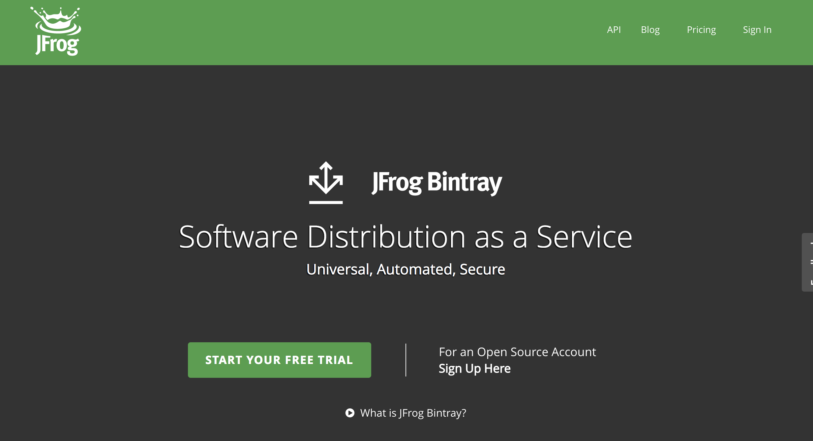
这是 Bintary 的主页，但我们不能直接点图中的绿色按钮注册，因为 Bntary 增加了 Organization 的概念，点击绿色按钮是默认创建一个组织的账户，我们需要创建的是自己的个人账户，所以这是一个注意的地方，千万不要选错。

    那么个人账户创建的地方是哪里呢？

    [https://bintray.com/signup/oss](https://bintray.com/signup/oss)

    就是上面的这个地址，点击进去创建个人账户，网页点开是这样的
    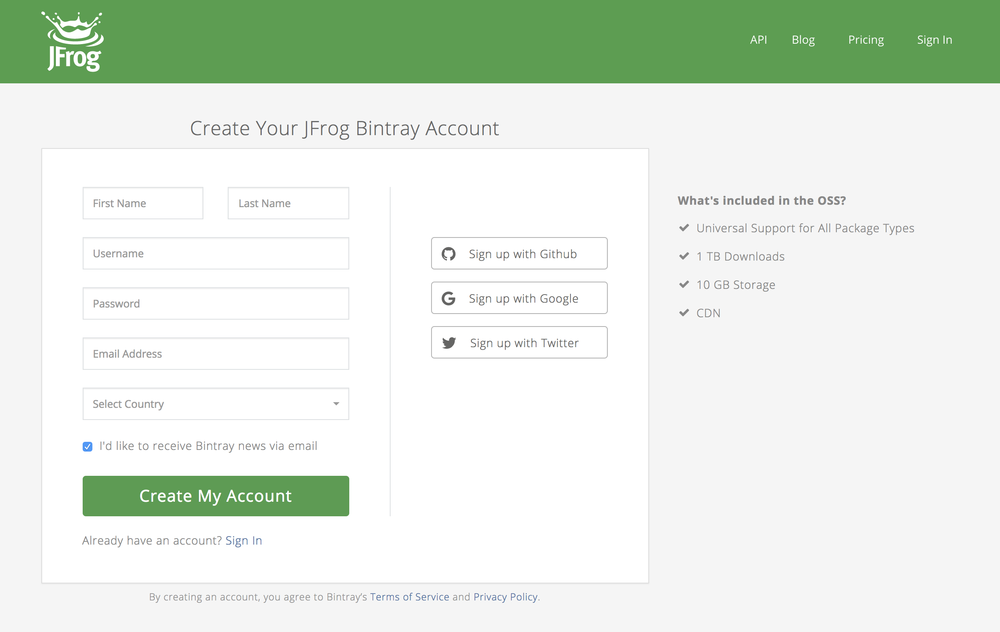
    登录成功之后点击创建一个 maven 仓库
    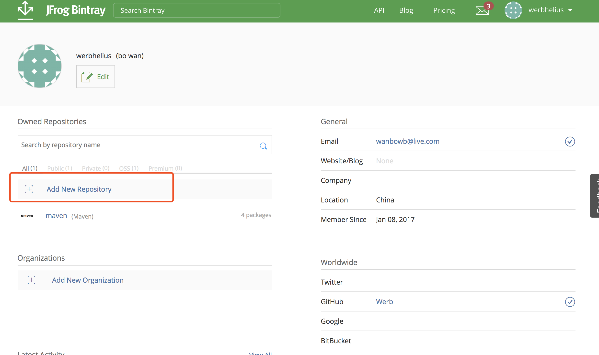
    填写仓库配置信息，type 选择 maven
    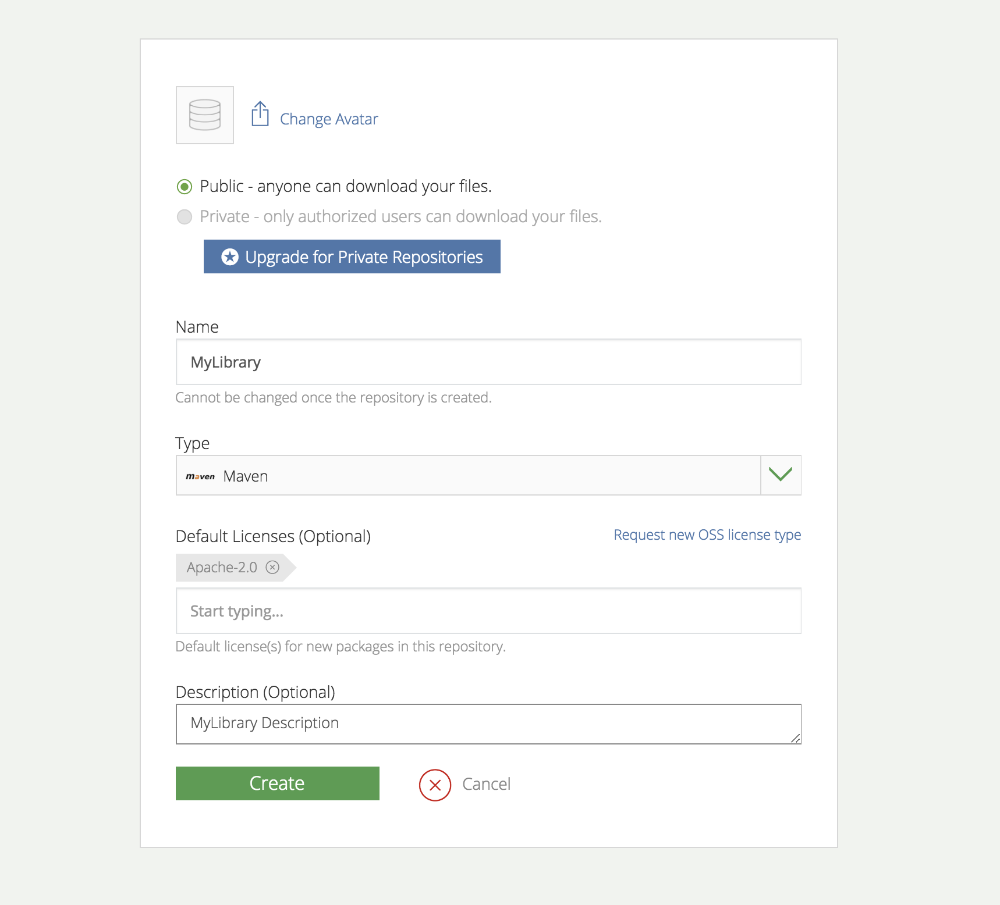
    创建成功以后你会看到下面这个页面，我这里创建的 maven 仓库名叫 MyLibrary
    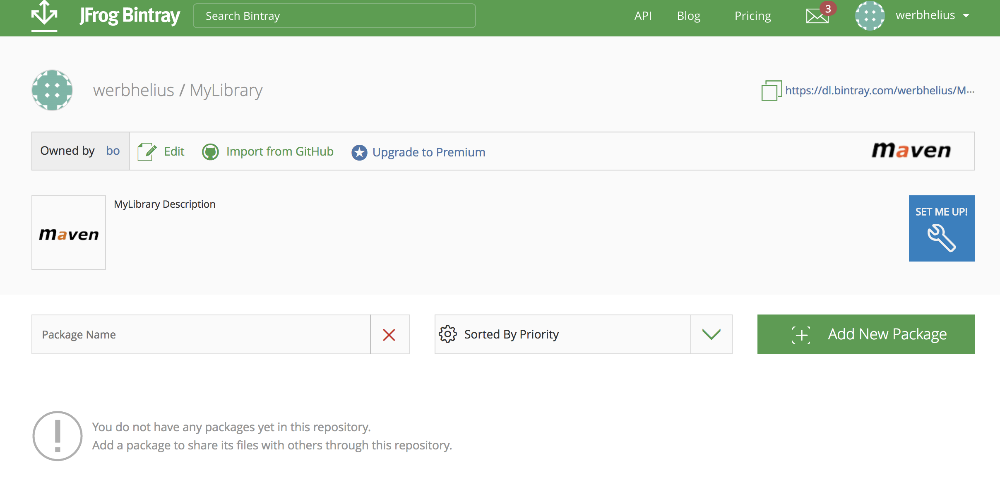

2. 获取 API key
    
    点击网页右上角的头像 Edit Profile，按照图中的操作保存我们的 API key，通过 API key 我们可以在 Android Studio 中发布我们的开源库到 Bintray 中。
    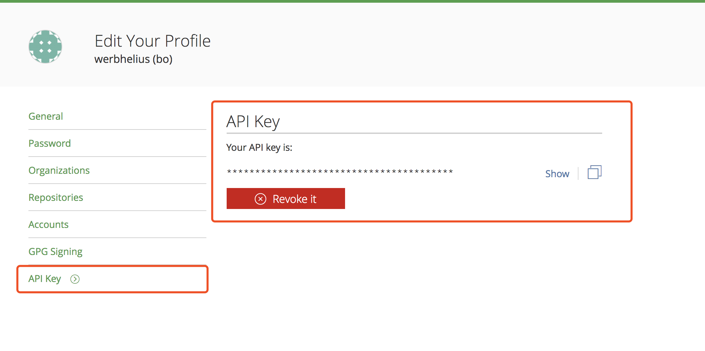

3. 配置我们的开源库

    如图所示，我们新建了一个 android-bintray-build 的 Android 项目，其中建了一个 Library moudle 叫做 bintraybuild，这个就是我们要上传的开源库，新建完成之后需要将项目上传至 Github。
    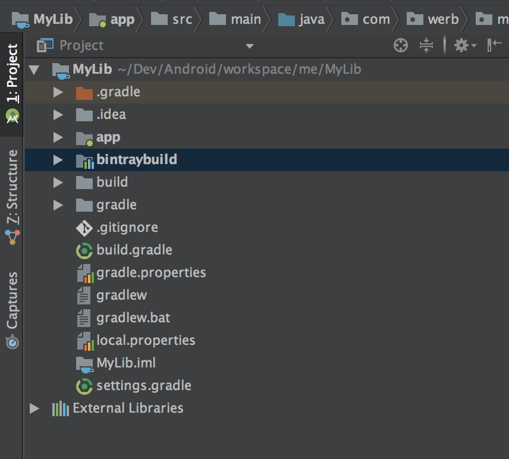

上传的方式有两种，第一种是通过 bintray 官方出的插件 

[bintray/gradle-bintray-plugin](https://github.com/bintray/gradle-bintray-plugin)

第二种是一个国外组织开源的插件

[novoda/bintray-release](https://github.com/novoda/bintray-release)

下面会为大家依次介绍这两种插件的使用方式

### bintray/gradle-bintray-plugin
1. 在项目根目录下的 **build.gradle** 添加插件依赖
```gradle
buildscript {
    
    repositories {
        google()
        jcenter()
        maven {url 'https://dl.bintray.com/werbhelius/MyLibrary/'}
    }
    dependencies {
        classpath 'com.android.tools.build:gradle:3.0.0'
        classpath 'com.jfrog.bintray.gradle:gradle-bintray-plugin:1.7.2'
        classpath 'com.github.dcendents:android-maven-gradle-plugin:1.5'
        // NOTE: Do not place your application dependencies here; they belong
        // in the individual module build.gradle files
    }
}
```
2. 在项目根目录下的 **gradle.properties** 中配置我们的开源库信息
```properties
PROJ_NAME=bintray-build
PROJ_GROUP=com.werb.bintraybuild
PROJ_ARTIFACTID=bintraybuild
PROJ_VERSION=0.1.0
PROJ_WEBSITEURL=https://github.com/Werb/android-bintray-build
PROJ_ISSUETRACKERURL=https://github.com/Werb/android-bintray-build/issues
PROJ_VCSURL=https://github.com/Werb/android-bintray-build.git
PROJ_DESCRIPTION=bintraybuild project

DEVELOPER_ID=wanbo
DEVELOPER_NAME=werbhelius
DEVELOPER_EMAIL=werbhelius@gmail.com
```
3. 在项目根目录下的 **local.properties** 中填写我们的 **user** 和 **API key**，这里的内容是完全可以放在 **gradle.properties** 中的，但是通常我们的开源库都会发到 Github 的公共仓库中，如果这样的话那我们的 **API key** 就会暴露给其他人，那当然是不行的，所以我们就在 **git 忽略的 local.properties 中**配置我们的 API key。
```
BINTRAY_USER=werbhelius
BINTRAY_KEY=xxxxxxxxxxxxxxxxxxxxxxxxxxxxxxxxxxx
```
4. 在我们开源库的目录下，新建一个 **bintray.gradle** 文件，用于上传开源库以及配置发布的文件内容包括源码，文档以及 AAR。
```gradle
group = PROJ_GROUP
version = PROJ_VERSION
project.archivesBaseName = PROJ_ARTIFACTID

apply plugin: 'com.jfrog.bintray'
apply plugin: 'com.github.dcendents.android-maven'

task sourcesJar(type: Jar) {
    from android.sourceSets.main.java.srcDirs
    classifier = 'sources'
}

task javadoc(type: Javadoc) {
    source = android.sourceSets.main.java.srcDirs
    classpath += configurations.compile
    classpath += project.files(android.getBootClasspath().join(File.pathSeparator))
}

task javadocJar(type: Jar, dependsOn: javadoc) {
    classifier = 'javadoc'
    from javadoc.destinationDir
}

javadoc {
    options{
        encoding "UTF-8"
        charSet 'UTF-8'
        author true
        version true
        links "https://androiddoc.qiniudn.com/reference/"
        title "$PROJ_NAME $PROJ_VERSION"
    }
}

artifacts {
    archives sourcesJar
    archives javadocJar
}

install {
    repositories.mavenInstaller {
        pom.project {
            name PROJ_NAME
            description PROJ_DESCRIPTION
            url PROJ_WEBSITEURL
            inceptionYear '2017'

            packaging 'aar'
            groupId PROJ_GROUP
            artifactId PROJ_ARTIFACTID
            version PROJ_VERSION

            licenses {
                license {
                    name 'The Apache Software License, Version 2.0'
                    url 'http://www.apache.org/licenses/LICENSE-2.0.txt'
                    distribution 'repo'
                }
            }
            scm {
                connection PROJ_VCSURL
                url PROJ_WEBSITEURL

            }
            developers {
                developer {
                    id DEVELOPER_ID
                    name DEVELOPER_NAME
                    email DEVELOPER_EMAIL
                }
            }
        }
    }
}

bintray {

    Properties properties = new Properties()
    properties.load(project.rootProject.file('local.properties').newDataInputStream())
    user = properties.getProperty('BINTRAY_USER')
    key = properties.getProperty('BINTRAY_KEY')
    configurations = ['archives']

    dryRun = false
    publish = true

    pkg {
        repo = 'MyLibrary'
        name = PROJ_NAME
        licenses = ['Apache-2.0']
        vcsUrl = PROJ_VCSURL
        websiteUrl = PROJ_WEBSITEURL
        issueTrackerUrl = PROJ_ISSUETRACKERURL
        publicDownloadNumbers = true
        version {
            name = PROJ_VERSION
            desc = PROJ_DESCRIPTION
            vcsTag = PROJ_VERSION

            gpg {
                sign = true
            }
        }
    }
}
```
这里向大家介绍一下 **aar** 和 **jar** 的区别。

***.jar** ：只包含了 **class** 文件与清单文件，不包含资源文件，如图片等所有 **res** 中的文件。
***.aar**：包含所有资源，**class** 以及 **res** 资源文件全部包含。

如果你只是一个简单的类库那么使用生成的 *.jar文件即可；如果你的是一个UI库，包含一些自己写的控件布局文件以及字体等资源文件那么就只能使用 *.aar 文件。

5. 在我们开源库中的 build.gradle 文件中引入 bintary.gradle ，注意引入的命令需要写在最后一行，不然会报错。
```gradle
dependencies {
    implementation fileTree(dir: 'libs', include: ['*.jar'])

    implementation 'com.android.support:appcompat-v7:26.1.0'
    testImplementation 'junit:junit:4.12'
    androidTestImplementation 'com.android.support.test:runner:1.0.1'
    androidTestImplementation 'com.android.support.test.espresso:espresso-core:3.0.1'
}

apply from: './bintray.gradle'
```
6. 当上述的配置全部完成之后，我们可以上传我们的开源库了，打开 **Terminal**，执行 **./gradlew install**，执行完成后，打开 build 目录你会发现生成了 **aar 包、javadoc 文档、sources 源码以及上传 maven 需要的 pom 配置文件**。
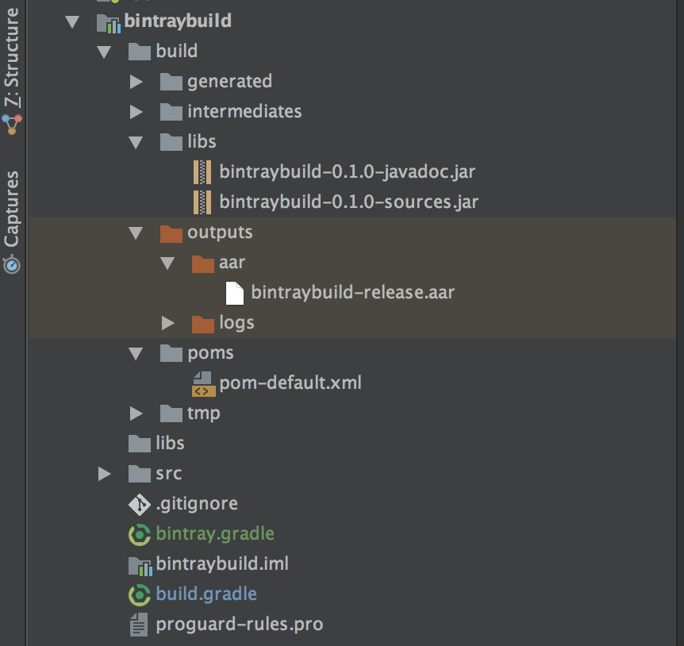
7. 生成上述文件后，继续在 **Terminal** 中执行 **./gradlew bintrayUpload** 提示成功之后，我们的开源库就发布成功啦。

**发布成功之后，打开之前 bintray 网页，你会发现在之前我们创建的 maven 仓库中，已经有我们刚刚发布的库了。**
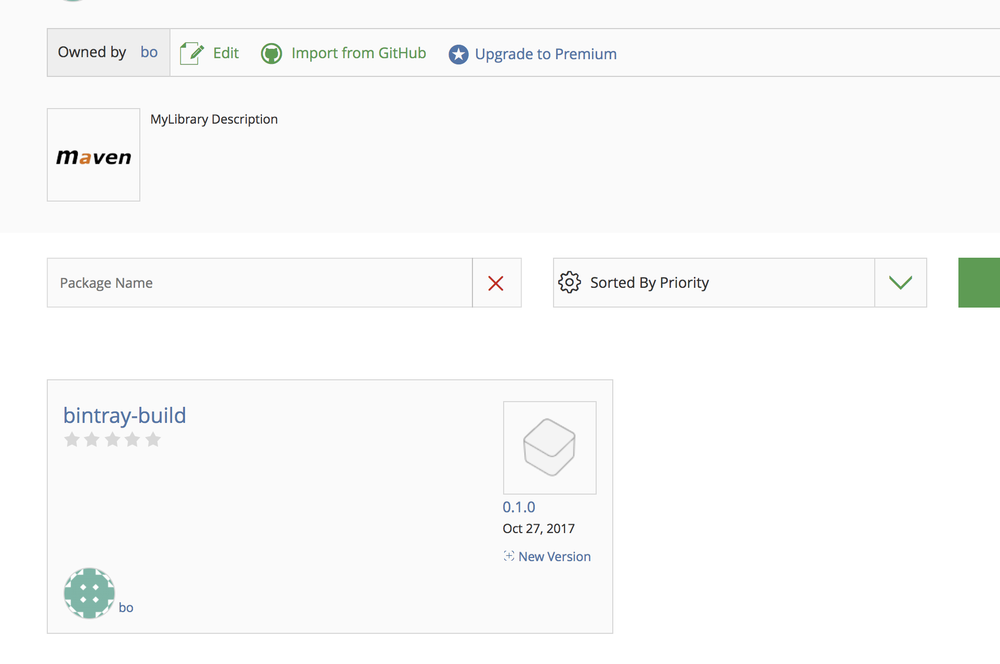

### novoda/bintray-release
使用这个插件上传比较简单，只需要两步就可以
1. 在项目根目录下的 **build.gradle** 添加插件依赖
```gradle
buildscript {
    
    repositories {
        google()
        jcenter()
        maven {url 'https://dl.bintray.com/werbhelius/MyLibrary/'}
    }
    dependencies {
        classpath 'com.android.tools.build:gradle:3.0.0'
        classpath 'com.novoda:bintray-release:0.5.0'

        // NOTE: Do not place your application dependencies here; they belong
        // in the individual module build.gradle files
    }
}
```
2. 在开源库的目录中 **build.gradle** 中配置上传的信息，同样配置到文件的最后。
```gradle
apply plugin: 'com.novoda.bintray-release'
publish {
    repoName = "MyLibrary"
    userOrg = 'werbhelius'
    groupId = 'com.werb.bintrayrelease'
    artifactId = 'bintrayrelease'
    publishVersion = '0.1.0'
    desc = 'bintraybuild project'
    website = 'https://github.com/Werb/android-bintray-build'
}
```
3. 发布我们的开源项目，在 Terminal 输入以下命令，替换 BINTRAY_USERNAME 和 BINTRAY_KEY 为你自己的 user 和 API key，执行命令之前需 Gradle Build。
```
./gradlew clean build bintrayUpload -PbintrayUser=BINTRAY_USERNAME -PbintrayKey=BINTRAY_KEY -PdryRun=false
```
**这样我们的开源库就上传成功啦。**

## 发布到 JCenter
在 bintray 开源库的网页中，右边会有 Add to JCenter 的提示，点击提交 commit 就可以啦，一般在几个小时或一天的时间就会提示你添加成功。
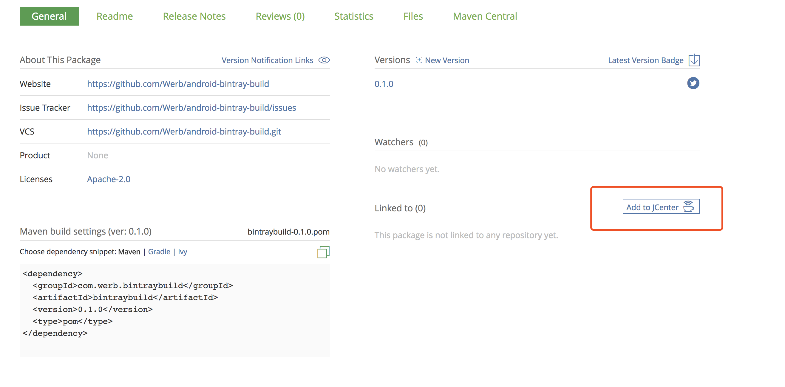
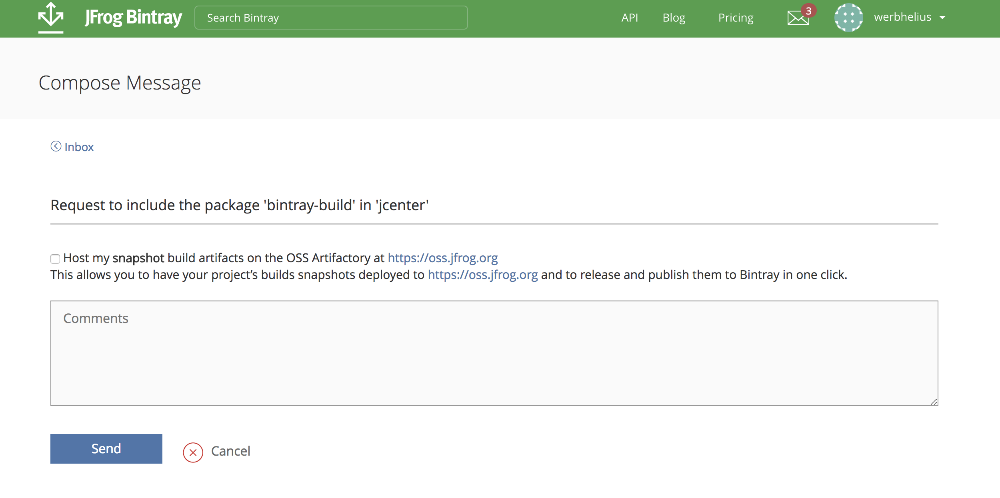

## 使用我们的开源库
这里向大家介绍一下我们之前配置的信息，两种发布方式的配置信息是一致的，我们以
**bintray/gradle-bintray-plugin** 为例。
```properties
PROJ_NAME=bintray-build
PROJ_GROUP=com.werb.bintraybuild
PROJ_ARTIFACTID=bintraybuild
PROJ_VERSION=0.1.0
PROJ_WEBSITEURL=https://github.com/Werb/android-bintray-build
PROJ_ISSUETRACKERURL=https://github.com/Werb/android-bintray-build/issues
PROJ_VCSURL=https://github.com/Werb/android-bintray-build.git
PROJ_DESCRIPTION=bintraybuild project

DEVELOPER_ID=wanbo
DEVELOPER_NAME=werbhelius
DEVELOPER_EMAIL=werbhelius@gmail.com
```
* PROJ_NAME : 开源库的名字
* PROJ_GROUP : 用于上传的 group id
* PROJ_ARTIFACID : 使用的 artifactId
* PROJ_VERSION : 发布的版本
* PROJ_WEBSITEURL : Github 地址
* PROJ_ISSUETRACKURL : Issue 地址
* PROJ_VCSURL : git 地址
* PROJ_DESCRIPTION : 开源库的描述

**所以当我们的库发布成功之后 Gradle 的依赖地址的格式为：**
```gradle
implementation 'groupId:artifactId:version'
```
**如果你成功发布到 JCenter 就可以直接按照上面的规则依赖自己的项目。**

**如果你没有发布到 JCenter 需要在项目根目录中的 build.gradle 中添加你的 maven 仓库地址。**
```gradle
buildscript {
    
    repositories {
        google()
        jcenter()
        maven {url 'https://dl.bintray.com/werbhelius/MyLibrary/'}
    }
    dependencies {
        classpath 'com.android.tools.build:gradle:3.0.0'
        classpath 'com.jfrog.bintray.gradle:gradle-bintray-plugin:1.7.2'
        classpath 'com.github.dcendents:android-maven-gradle-plugin:1.5'
        classpath 'com.novoda:bintray-release:0.5.0'

        // NOTE: Do not place your application dependencies here; they belong
        // in the individual module build.gradle files
    }
}

allprojects {
    repositories {
        google()
        jcenter()
        maven {url 'https://dl.bintray.com/werbhelius/MyLibrary/'}
    }
}

task clean(type: Delete) {
    delete rootProject.buildDir
}
```

## 注意事项
1. 不同的开源库需上传至不同的 Github 仓库中，因为我们在 bintray 上会指定开源库的 Github 地址，请确保唯一性。
2. 随着 Android Studio 3.0 的发布，Gradle 更新到了 4.1+，在 Gradle 3.6 之后的版本，增加了 implementation 和 api 等新的依赖命令，需要注意的是，以上两种插件的 Gradle 版本均在 3.6 以下，所以是不支持新的命令的。这样会引发一个错误，当你的 Labrary 依赖其他开源项目的时候，如果你是使用的 implementation 和 api 等新的依赖命令，在生成 aar 和 maven pom 文件时，pom 文件中并不会把你 Labrary 中所依赖的其他库配置进去，这样当在使用你的 Labrary 构建依赖的时候，Gradle 不会把 Labrary 中所依赖的库一并下载下来，当使用这些库的时候就会引发 ClassNotFound 的错误。所以在上面两个插件还没有更新到最新版的 Gradle 的时候，请继续使用旧的 compile 依赖命令。
3. 有关 Android Studio 3.0 新的依赖方式，请查看上期更新的文章：[Android Studio 3.0 新的依赖方式](https://mp.weixin.qq.com/s?__biz=MzU5NjI1MjAzNA==&mid=2247483813&idx=1&sn=919e2abc8e3236dc6663a7909be1fbd3&chksm=fe64c548c9134c5eda7777cdfd81ffc12242143dc70cafb6c08d4bae5f7979343190b01609dd&scene=21#wechat_redirect)

## 源码
有关以上两种上传方式的代码已经发布到 Github，关于更多的配置可以参照 Github 上面的代码，地址如下：

[https://github.com/Werb/android-bintray-build](https://github.com/Werb/android-bintray-build)

**如果你有好的开源库可以直接在公众号发送你的仓库地址，一起分享一下！**

 探索有趣的新事物 
Android、Kotlin、设计、产品、思考、游戏。


长按关注

如果觉得有意思，那就分享一下啦 
